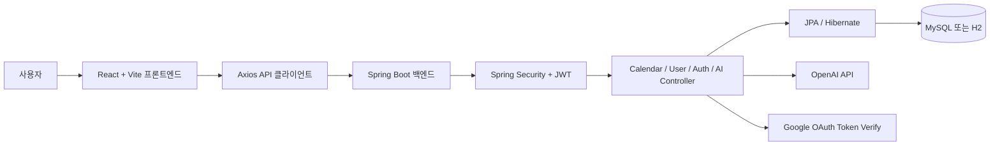

# MyNotionAI

MyNotionAI는 AI 기반 일정 관리 경험을 제공하는 프로젝트입니다. Spring Boot 백엔드와 React 프론트엔드를 하나의 저장소에서 함께 관리하는 모노레포 구조로 구성되어 있습니다.

## 프로젝트 소개

사용자는 캘린더 화면에서 일정을 조회하고 등록·수정·삭제할 수 있으며, AI 기능을 통해 일정 관련 내용을 분석하거나 정리된 요약을 받아볼 수 있습니다. 이메일 로그인과 Google 로그인도 함께 지원합니다.

## 주요 기능

- 회원가입, 로그인, JWT 기반 인증
- Google OAuth 토큰 로그인
- 월별 일정 조회
- 일정 등록, 수정, 삭제
- AI 일정 분석, 적용, 수정, 취소
- 오늘 일정 요약 및 AI 대화 로그 조회
- 사용자 프로필 조회 및 수정

## 기술 스택

- 프론트엔드: React 19, Vite 7, React Router 7, Axios, TanStack Query, Zustand
- 백엔드: Java 17, Spring Boot 3.2, Spring Security, Spring Data JPA, JWT
- 데이터베이스: MySQL 기본 사용, 로컬 개발용 H2 지원
- 빌드 도구: Maven, npm

## 내가 맡은 역할

아래 예시는 자리표시자이므로 실제 담당 범위에 맞게 수정해서 사용하면 됩니다.

- 예시: React 기반 로그인 및 캘린더 화면 구현
- 예시: Spring Boot 인증 및 일정 CRUD API 구현
- 예시: OpenAI 연동 기능과 프론트-백엔드 연결 작업 담당
- 예시: 로컬 실행 환경 구성 및 통합 테스트 지원

## 화면 흐름

채용담당자가 빠르게 이해할 수 있도록 주요 사용자 흐름을 먼저 보여줍니다. 현재 저장소에는 실제 서비스 스크린샷 대신 와이어프레임 이미지가 포함되어 있어, 아래에는 핵심 화면 흐름을 바로 확인할 수 있도록 정리했습니다.

### 1. 로그인


### 2. 홈 / 랜딩


### 3. 캘린더


### 4. AI 패널 및 일정 편집 흐름


위 흐름은 `로그인 -> 홈 -> 캘린더 -> AI 기반 일정 상호작용`으로 이어지며, 사용자는 인증 이후 일정 조회와 수정, AI 응답 확인까지 한 흐름으로 이동할 수 있습니다.

## 아키텍처 다이어그램



## 구조 요약

- 프론트엔드는 React와 Vite 기반으로 동작하며, Axios를 통해 백엔드 API를 호출합니다.
- 백엔드는 Spring Security와 JWT로 인증을 처리하고, 인증 이후 일정·사용자·AI 관련 API를 제공합니다.
- 데이터는 기본적으로 MySQL에 저장되며, 로컬 개발 환경에서는 H2 기반 실행도 가능합니다.
- AI 관련 기능은 백엔드에서 OpenAI API를 호출해 일정 분석, 수정, 요약 흐름을 처리합니다.

## 현재 상태와 개선 계획

이 프로젝트는 동작하는 MVP를 우선 완성한 뒤, 사용자 경험과 운영 품질을 단계적으로 보강하는 방향으로 정리하고 있습니다. 아래 항목은 실제 코드 기준으로 확인되는 현재 상태와 다음 개선 방향입니다.

- Google 로그인은 현재 `window.prompt`로 ID 토큰을 입력받는 임시 MVP 흐름이며, 이후 Google OAuth 버튼과 리디렉션 기반 정식 로그인 UI로 전환할 예정입니다.
- AI 일정 해석은 현재 `AiService`에서 날짜·시간 패턴을 해석해 초안을 만드는 규칙 기반 방식이며, 이후 LLM 보조 해석을 결합해 더 자연스러운 일정 추출과 수정 제안을 지원할 예정입니다.
- 오늘 일정 요약은 현재 일정 개수와 첫 일정 제목을 조합하는 요약 방식이며, 이후 사용자 맥락을 반영한 자연어 브리핑 형태로 확장할 예정입니다.
- 예외 처리는 현재 서비스 레이어의 `ResponseStatusException` 중심으로 구성되어 있으며, 이후 공통 예외 응답 포맷과 예외 처리 가이드를 문서화해 운영 일관성을 높일 예정입니다.
- 테스트 코드는 아직 본격적으로 구성되지 않았으며, 이후 인증, 일정 CRUD, AI 분석 흐름을 중심으로 서비스 및 API 테스트를 보강할 예정입니다.

## 실행 방법

### 1. 백엔드 실행

사전 요구사항

- Java 17 이상
- Maven 3.9 이상 또는 `backend/run-backend-h2.cmd`에서 사용하는 내장 Maven

기본 실행은 MySQL 기준입니다. 필요한 환경 변수:

```powershell
$env:DB_PASSWORD="your-db-password"
$env:JWT_SECRET="your-jwt-secret"
$env:OPENAI_API_KEY="your-openai-api-key"
$env:GOOGLE_OAUTH_CLIENT_ID="your-google-client-id"
```

MySQL 기준 실행:

```powershell
cd backend
mvn spring-boot:run
```

로컬 H2 기반 실행:

```powershell
backend\run-backend-h2.cmd
```

백엔드 기본 주소:

- API: `http://localhost:8080/api`

### 2. 프론트엔드 실행

```powershell
cd frontend\mynotion-frontend
Copy-Item .env.example .env
npm install
npm run dev -- --host 127.0.0.1 --port 5173
```

프론트엔드 환경 변수:

```env
VITE_API_URL=http://localhost:8080/api
VITE_APP_NAME=MyNotion AI
VITE_GOOGLE_CLIENT_ID=
```

프론트엔드 주소:

- `http://127.0.0.1:5173`

## 트러블슈팅

### 프론트엔드에서 백엔드 호출이 실패하는 경우

- `VITE_API_URL`이 `http://localhost:8080/api`로 설정되어 있는지 확인합니다.
- 백엔드가 `8080` 포트에서 실행 중인지 확인합니다.
- 프론트 개발 서버 주소가 `localhost:5173` 또는 `127.0.0.1:5173`인지 확인합니다.

### MySQL 연결이 실패하는 경우

- MySQL이 실행 중인지, `mynotion` 데이터베이스가 존재하는지 확인합니다.
- `DB_PASSWORD` 값과 `backend/src/main/resources/application.yml` 설정을 확인합니다.
- 로컬 확인이 우선이면 `backend\run-backend-h2.cmd`로 H2 기반 실행을 사용합니다.

### JWT 또는 Google 로그인이 동작하지 않는 경우

- `JWT_SECRET` 환경 변수가 설정되어 있는지 확인합니다.
- `GOOGLE_OAUTH_CLIENT_ID`와 `VITE_GOOGLE_CLIENT_ID`가 동일한 클라이언트를 가리키는지 확인합니다.

### AI 기능 호출이 실패하는 경우

- `OPENAI_API_KEY`가 설정되어 있는지 확인합니다.
- H2 실행 스크립트를 사용했다면 `backend/spring-boot.log`에서 오류를 확인합니다.

### README나 한글 문서가 깨져 보이는 경우

- 문서 파일이 UTF-8로 저장되어 있는지 확인합니다.
- 에디터의 인코딩 감지가 UTF-8로 되어 있는지 확인합니다.
