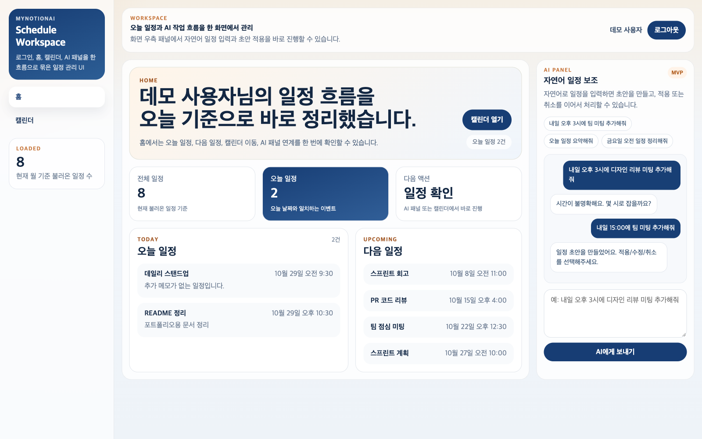
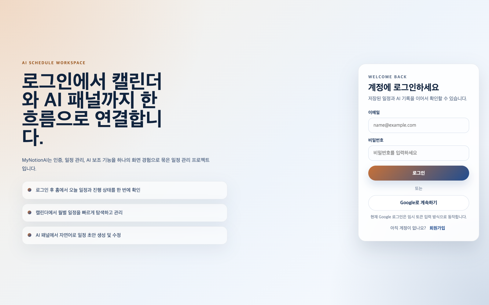
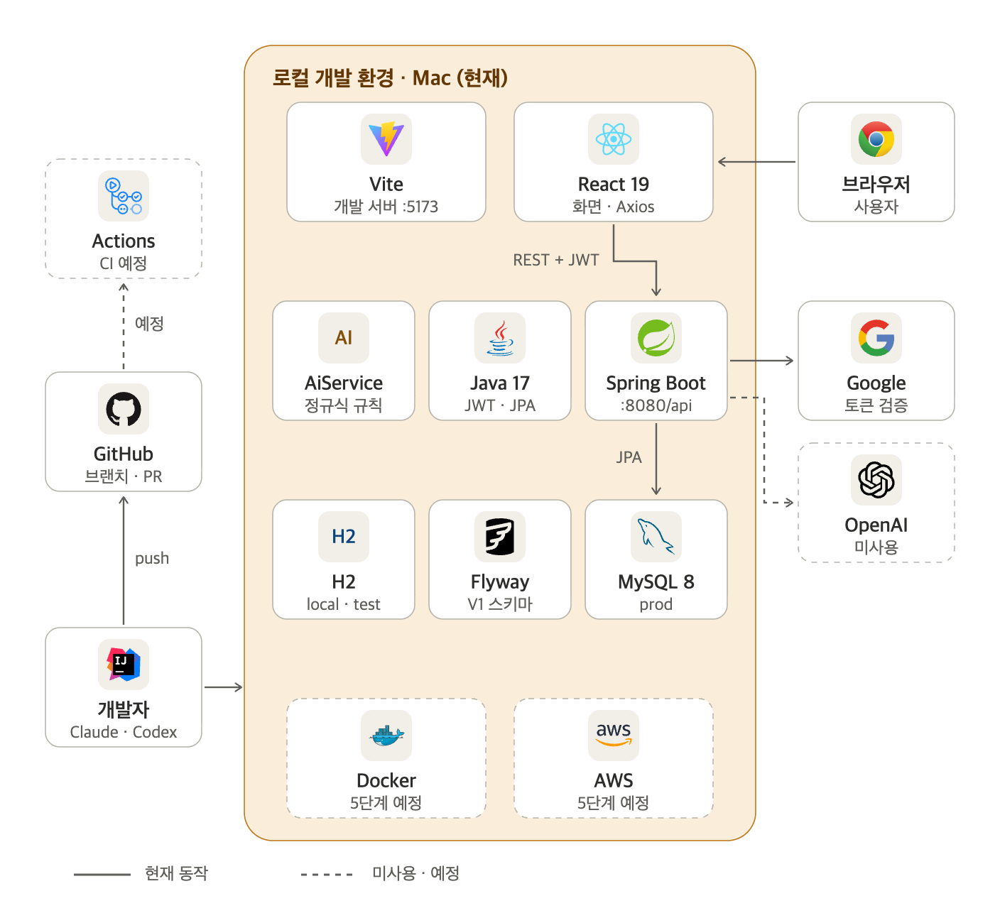
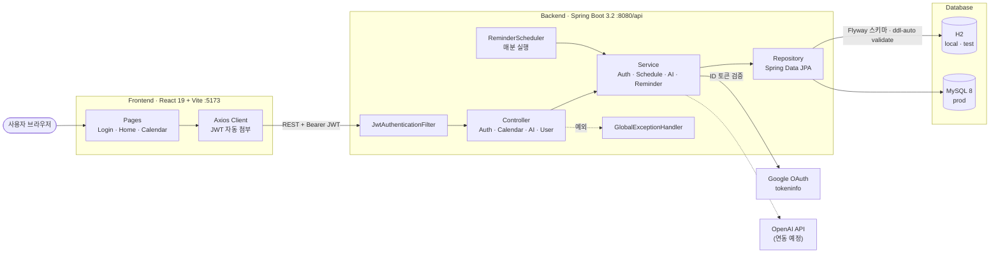
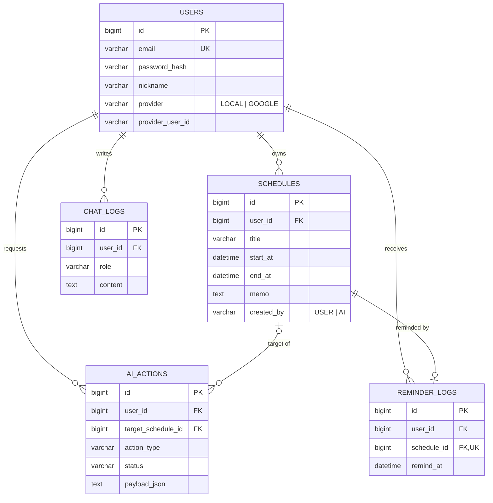

# MyNotionAI

> 자연어로 일정을 등록하고 관리하는 **AI 일정 관리 서비스**
> Spring Boot 백엔드와 React 프론트엔드를 하나의 저장소에서 관리하는 모노레포입니다.


## 목차

1. [프로젝트 소개](#프로젝트-소개)
2. [주요 기능](#주요-기능)
3. [기술 스택](#기술-스택)
4. [시스템 아키텍처](#시스템-아키텍처)
5. [ERD](#erd)
6. [API](#api)
7. [기술적 고민과 해결](#기술적-고민과-해결)
8. [테스트](#테스트)
9. [협업 방식](#협업-방식)
10. [현재 한계와 개선 로드맵](#현재-한계와-개선-로드맵)
11. [실행 방법](#실행-방법)

## 프로젝트 소개

캘린더에서 일정을 직접 관리하거나, **"내일 15:00에 팀 미팅 추가해줘"**처럼 자연어로 요청해 일정 초안을 받아 적용할 수 있는 서비스입니다.

동작하는 MVP를 먼저 완성한 뒤, **실무 백엔드 주제(예외 설계, 테스트, DB 마이그레이션, 외부 API 연동, 운영)를 단계적으로 적용하는 것**을 목표로 고도화하고 있습니다.

### 홈 · 오늘 일정과 AI 패널



### 캘린더 · 자연어로 일정 초안 생성


<details>
<summary>로그인 화면</summary>



</details>

<sub>※ 로컬 환경(`local` 프로필)에서 데모 데이터로 촬영한 실제 화면입니다. 초기 와이어프레임은 [`docs/WireFrame`](docs/WireFrame)에 있습니다.</sub>

## 주요 기능

| 분류 | 기능 |
|---|---|
| 인증 | 이메일 회원가입·로그인, JWT 기반 Stateless 인증, Google ID 토큰 로그인 |
| 일정 | 월별 조회, 등록·수정·삭제, 사용자별 데이터 격리 |
| AI 일정 보조 | 자연어 → 일정 초안 생성, 초안 적용·수정·취소, 오늘 일정 요약, 대화 로그 |
| 리마인더 | 1분 주기 스케줄러가 1시간 뒤 시작하는 일정을 찾아 알림 기록 |

## 기술 스택

| 영역 | 기술 |
|---|---|
| Backend | Java 17, Spring Boot 3.2, Spring Security, Spring Data JPA (Hibernate 6.3), JJWT 0.12 |
| Database | MySQL 8 (운영), H2 (로컬·테스트), Flyway 마이그레이션 |
| Frontend | React 19, Vite 7, React Router 7, TanStack Query, Zustand, Axios |
| Test | JUnit 5, Mockito, `@WebMvcTest`, `@DataJpaTest`, spring-security-test, k6 (부하 테스트) |
| Infra · 관측 | Docker Compose (앱·MySQL·Prometheus·Grafana), Spring Boot Actuator + Micrometer, Prometheus, Grafana |
| Tool | Maven, npm, Docker (검증용 MySQL), GitHub |

## 시스템 아키텍처



### 요청 흐름


```mermaid
flowchart LR
    User(["사용자 브라우저"])

    subgraph FE["Frontend · React 19 + Vite :5173"]
        Pages["Pages<br/>Login · Home · Calendar"]
        Axios["Axios Client<br/>JWT 자동 첨부"]
    end

    subgraph BE["Backend · Spring Boot 3.2 :8080/api"]
        Filter["JwtAuthenticationFilter"]
        Controller["Controller<br/>Auth · Calendar · AI · User"]
        Service["Service<br/>Auth · Schedule · AI · Reminder"]
        Repo["Repository<br/>Spring Data JPA"]
        Handler["GlobalExceptionHandler"]
        Scheduler["ReminderScheduler<br/>매분 실행"]
    end

    subgraph DB["Database"]
        H2[("H2<br/>local · test")]
        MySQL[("MySQL 8<br/>prod")]
    end

    Google["Google OAuth<br/>tokeninfo"]
    OpenAI["OpenAI API<br/>(연동 예정)"]

    User --> Pages --> Axios -->|"REST + Bearer JWT"| Filter --> Controller --> Service --> Repo
    Repo -->|"Flyway 스키마 · ddl-auto validate"| H2
    Repo --> MySQL
    Controller -.->|"예외"| Handler
    Scheduler --> Service
    Service -->|"ID 토큰 검증"| Google
    Service -.-> OpenAI
```

### 백엔드 패키지 구조

```
backend/src/main/java/com/mynotionai/
├── controller/   REST API (Auth, Calendar, AI, User)
├── service/      비즈니스 로직 (Auth, Schedule, AI, GoogleTokenVerifier, Reminder)
├── repository/   Spring Data JPA
├── entity/       User, Schedule, ChatLog, AiAction, ReminderLog
├── dto/          요청·응답 DTO
├── exception/    ErrorCode, BusinessException, ApiErrorResponse, GlobalExceptionHandler
├── config/       SecurityConfig (CORS, Stateless, /auth/** 공개)
└── security/     JwtTokenProvider, JwtAuthenticationFilter
```

### 실행 프로필

| 프로필 | DB | 용도 |
|---|---|---|
| `local` (기본값) | H2 파일 (`backend/data/`) | 로컬 개발, 환경 변수 없이 실행 |
| `prod` | MySQL 8 | 운영, `DB_USERNAME`·`DB_PASSWORD`·`JWT_SECRET` 없으면 시작 실패 |
| `test` | H2 인메모리 (`MODE=MySQL`) | `mvn test` 전용 |

## ERD


```mermaid
erDiagram
    USERS ||--o{ SCHEDULES : owns
    USERS ||--o{ CHAT_LOGS : writes
    USERS ||--o{ AI_ACTIONS : requests
    USERS ||--o{ REMINDER_LOGS : receives
    SCHEDULES |o--o{ AI_ACTIONS : "target of"
    SCHEDULES ||--o| REMINDER_LOGS : "reminded by"

    USERS {
        bigint id PK
        varchar email UK
        varchar password_hash
        varchar nickname
        varchar provider "LOCAL | GOOGLE"
        varchar provider_user_id
    }
    SCHEDULES {
        bigint id PK
        bigint user_id FK
        varchar title
        datetime start_at
        datetime end_at
        text memo
        varchar created_by "USER | AI"
    }
    CHAT_LOGS {
        bigint id PK
        bigint user_id FK
        varchar role
        text content
    }
    AI_ACTIONS {
        bigint id PK
        bigint user_id FK
        bigint target_schedule_id FK
        varchar action_type
        varchar status
        text payload_json
    }
    REMINDER_LOGS {
        bigint id PK
        bigint user_id FK
        bigint schedule_id FK, UK
        datetime remind_at
    }
```

## API

Base URL: `http://localhost:8080/api` · `/auth/**` 외에는 `Authorization: Bearer <JWT>` 필요

| 분류 | Method | Path | 설명 |
|---|---|---|---|
| 인증 | POST | `/auth/register` | 회원가입 |
| | POST | `/auth/login` | 이메일 로그인 |
| | POST | `/auth/google` | Google ID 토큰 로그인 |
| 일정 | GET | `/calendar/events?year=&month=` | 월별 조회 |
| | POST | `/calendar/events` | 등록 |
| | PUT | `/calendar/events/{id}` | 수정 |
| | DELETE | `/calendar/events/{id}` | 삭제 |
| AI | POST | `/ai/analyze` | 자연어 → 일정 초안 |
| | POST | `/ai/apply` · `/ai/revise` · `/ai/cancel` | 초안 적용 · 수정 · 취소 |
| | GET | `/ai/today-summary` | 오늘 일정 요약 |
| | GET | `/ai/chat-logs?limit=` | AI 대화 로그 |
| 사용자 | GET · PUT | `/user/profile` | 프로필 조회 · 수정 |

에러 응답은 공통 형식으로 통일되어 있습니다.

```json
{
  "code": "INVALID_INPUT",
  "message": "Invalid input",
  "timestamp": "2026-10-29T15:00:00",
  "fieldErrors": { "title": "제목은 필수입니다" }
}
```

`fieldErrors`는 입력값 검증 실패 시에만 포함됩니다. 예: 없는 일정 조회 → `404 SCHEDULE_NOT_FOUND`

## 기술적 고민과 해결

각 작업은 `문제 → 원인 → 해결 → 결과` 순서로 기록했습니다. 상세 내용은 [`docs/tasks`](docs/tasks)와 [`docs/reviews`](docs/reviews)에 있습니다.

### 1. 공통 예외 처리와 내부 정보 노출 차단

- **문제**: 서비스마다 `ResponseStatusException`을 직접 던져 에러 응답 형식이 제각각이었고, 잘못된 JSON 요청 시 Jackson 파싱 상세(Java 타입명)가, 500 에러 시 서버 설정 메시지가 그대로 응답에 노출되었습니다.
- **원인**: 예외 메시지(`ex.getMessage()`)를 클라이언트 응답에 그대로 사용했습니다.
- **해결**: `ErrorCode` enum + `BusinessException` + `ResponseEntityExceptionHandler`를 상속한 `GlobalExceptionHandler`로 응답 형식을 통일했습니다. 5xx는 일반 메시지로 바꾸고 상세는 로그로만 남기며, 표준에 없는 상태 코드도 안전하게 처리합니다.
- **결과**: 404·400·405·500 등 11개 Controller 테스트로 "내부 정보가 응답에 없음"을 검증합니다.

### 2. 월별 조회 경계 버그 (`BETWEEN`의 함정)

- **문제**: 9월 일정을 조회하면 **10월 1일 0시** 일정이 함께 나오고, 오늘 요약에 **내일 0시** 일정이 포함되었습니다.
- **원인**: Spring Data JPA의 `findBy...Between`은 SQL `BETWEEN`으로 바뀌어 **양 끝을 모두 포함**합니다.
- **해결**: JPQL로 반개구간 `[from, to)` (`startAt >= :from and startAt < :to`) 조회 메서드를 만들고, 잘못된 메서드는 삭제했습니다.
- **결과**: 실제 H2 쿼리로 "시작 직전·시작 정각·끝 직전·끝 정각" 4개 경계를 검증하는 리포지토리 테스트를 추가했습니다.

### 3. `ddl-auto: update`에서 Flyway로

- **문제**: Hibernate가 스키마를 기록 없이 바꾸고, 운영에서 `JWT_SECRET`이 빠져도 개발용 기본값으로 앱이 시작되었습니다.
- **해결**: `local`·`prod`·`test` 프로필을 분리하고, 스키마를 `V1__init_schema.sql`로 관리하도록 바꿨습니다. Hibernate는 `validate`로 엔티티와 테이블이 일치하는지만 검사합니다. 기존 운영 DB는 `baseline-on-migrate`로 V1 상태로 인정합니다.
- **도입 중 발견한 문제 두 가지**
  - **H2 인덱스 이름 충돌**: 두 테이블이 같은 인덱스 이름 `idx_user_created`를 사용했습니다. MySQL은 테이블 단위로, H2는 스키마 전체에서 이름이 유일해야 해서 마이그레이션이 실패했습니다. → 테이블별 이름으로 변경했습니다.
  - **MySQL enum 타입 불일치**: Hibernate 6의 `MySQLDialect`는 `@Enumerated(STRING)` 컬럼을 native `ENUM`으로 기대하지만 V1은 `VARCHAR`로 만들었습니다. H2 테스트는 통과했지만 **빈 MySQL에서는 앱 시작이 실패**했습니다. → `@JdbcTypeCode(SqlTypes.VARCHAR)`로 매핑을 명시했습니다.
- **결과**: Docker `mysql:8.0` 일회용 컨테이너로 **수정 전 실패 재현 → 수정 후 정상 기동**을 확인했습니다. "H2의 MySQL 모드는 MySQL이 아니다"라는 점을 배웠고, 이 규칙을 팀 문서(`AGENTS.md`)에 남겼습니다.

### 4. 관측성: 지표 노출 → 수집·시각화 → 기준선

- **문제**: 요청 수, 응답 시간, 에러 비율, JVM 메모리, DB 커넥션 풀 상태를 확인할 방법이 없었습니다. 2단계에서 대화 로그 페이징이나 Reminder N+1을 고쳐도 "빨라졌다"를 숫자로 보여줄 수 없었습니다.
- **원인**: 앱이 지표를 내보내지 않았고, 지표를 모아 그래프로 보여줄 도구도, 개선 전후를 비교할 기준값도 없었습니다.
- **해결**: 세 단계로 나눠 쌓았습니다.
  - **노출**: Actuator + Micrometer Prometheus registry로 지표를 내보내고, 사용자 API(8080)와 인증 규칙이 섞이지 않도록 **관리 포트 8081**로 분리했습니다. `health`·`prometheus`만 허용합니다.
  - **수집·시각화**: Docker Compose로 앱(`prod`)·MySQL·Prometheus·Grafana를 한 번에 띄우고, Grafana 대시보드 `MyNotion Overview`(6개 패널)를 자동 등록했습니다. 8081·3306은 호스트에 공개하지 않고, 공개 포트는 `127.0.0.1`에만 바인딩했습니다.
  - **기준선**: k6로 20 VU(일정 조회 12 / 대화 로그 조회 4 / 일정 등록 4)를 워밍업 1분 → 유지 5분 → 감소 1분으로 걸어 개선 전 수치를 기록했습니다.
- **결과** (유지 구간 5분, k6 클라이언트 측): 3개 엔드포인트 p95가 약 11ms(`GET /calendar/events` 10.85ms, `GET /ai/chat-logs` 11.49ms, `POST /calendar/events` 11.88ms), 에러율 0%였습니다. 앱 CPU 평균 0.82%, HikariCP 활성 커넥션 최대 1개로, 이 수치는 **저부하 응답 시간**이며 처리 한계는 측정하지 않았습니다. 상세 수치와 PromQL은 [`docs/performance/20261117-baseline.md`](docs/performance/20261117-baseline.md)에 있습니다.
- **배운 점**
  - **시계열 부재와 0은 다르다**: 5xx 에러 비율 패널은 5xx 요청이 한 번도 없으면 분자 시계열이 아예 없어 정상 트래픽에서도 값이 비어 보였습니다. 분자에만 `or vector(0)`을 붙여 "트래픽 없음(빈 값)"과 "에러 0"을 구분했습니다.
  - **측정 환경도 결과의 일부다**: 첫 측정은 도중에 Mac이 잠자기에 들어가 수치를 버렸고, `caffeinate -i -s`로 감싸 다시 측정했습니다.

## 테스트

```bash
cd backend
JAVA_HOME=$(/usr/libexec/java_home -v 17) mvn test   # 48개 통과
```

| 테스트 클래스 | 종류 | 개수 | 검증 내용 |
|---|---|---|---|
| `CalendarControllerTest` | `@WebMvcTest` | 11 | 공통 에러 응답, 검증 실패, 내부 정보 비노출, 405·비표준 상태 코드 |
| `ScheduleServiceTest` | Mockito | 12 | 일정 CRUD, 시간 범위 검증, 다른 사용자 일정 접근 차단 |
| `AuthServiceTest` | Mockito | 8 | 회원가입·로그인, 비밀번호 해시 저장 확인 |
| `JwtTokenProviderTest` | 단위 | 10 | 토큰 생성·검증·만료·위조 |
| `ScheduleRepositoryTest` | `@DataJpaTest` | 6 | 사용자 격리, 정렬, 월·일 경계 (실제 SQL) |
| `FlywayMigrationTest` | `@DataJpaTest` | 1 | V1 마이그레이션 적용 |

> 테스트는 반드시 JDK 17로 실행합니다. JDK 26에서는 Mockito가 클래스를 mock 하지 못해 실패합니다.

## 협업 방식

AI 에이전트를 역할별로 나누고, 모든 전달은 **문서**로 남기는 방식으로 진행합니다. 규칙은 [`AGENTS.md`](AGENTS.md) 하나로 관리합니다.

| 역할 | 담당 | 산출물 |
|---|---|---|
| PM | Claude | 작업 지시서 [`docs/tasks`](docs/tasks), 검증, 브랜치·PR 관리 |
| 개발 · 리뷰 | Codex | 구현과 테스트, 별도 세션의 코드 리뷰 [`docs/reviews`](docs/reviews) |
| 의사결정 | 개발자 본인 | 방향 결정, 지시서·머지 승인 |

`요청 → 작업 지시서 → 구현 → 다른 세션에서 코드 리뷰 → 반영 → 테스트·실제 기동 검증 → PR·머지` 순서로 진행하며, 작업 하나에 브랜치 하나, 커밋은 작은 단위로 나눕니다.

## 현재 한계와 개선 로드맵

### 알려진 문제

| 심각도 | 문제 | 계획 |
|---|---|---|
| 높음 | AI 시간 해석이 JDK 17에서 `"3시"`를 인식하지 못하고, `"오후"`를 처리하지 않아 오후 3시가 03:00으로 해석될 수 있음 | `fix/ai-time-parsing` |
| 높음 | 인증 실패가 401이 아닌 403으로 응답되어, 프론트의 "401이면 토큰 삭제" 처리가 동작하지 않음 | 4단계 `AuthenticationEntryPoint` |
| 중간 | AI 초안 제목에 시간과 요청 문구가 남음 (예: `"15:00에 팀 미팅 추가해줘"` → 제목 그대로) | `fix/ai-time-parsing`과 함께 |
| 중간 | 홈의 "다음 일정"에 이미 지난 일정이 표시됨 | 프론트 수정 |
| 중간 | AI 대화 로그를 전부 조회한 뒤 메모리에서 잘라냄 | 2단계 페이징 |
| 중간 | 리마인더가 일정마다 중복 확인 쿼리를 실행(N+1)하고, 서버가 여러 대면 중복 실행 위험 | 2단계 N+1 해결, 4단계 ShedLock |
| 중간 | OpenAI 설정과 라이브러리는 있으나 실제 호출 코드 없음 (규칙 기반만 동작) | 3단계 LLM 연동 |
| 낮음 | Google 로그인이 `window.prompt`로 ID 토큰을 입력받는 임시 방식 | OAuth 버튼 방식 전환 |
| 낮음 | CORS origin 하드코딩, `AiService`(257줄)의 책임 과다, CI 없음 | 3·5단계 |
| 낮음 | 부하 테스트 결과는 k6와 서버가 같은 Mac 한 대에서 측정한 상대 비교용 수치임 | 같은 머신·같은 Docker 설정에서 개선 전후 비교 |

### 로드맵

| 단계 | 주제 | 상태 |
|---|---|---|
| 1. 기초 체력 | 공통 예외 처리, 프로필 분리 + Flyway, Controller 테스트, Swagger | 🟢 예외 처리·Flyway 완료 / Controller 테스트·Swagger 진행 예정 |
| 2. 도메인 & 데이터 | 일정 겹침 검사, 반복 일정, Reminder N+1, 페이징 | ⚪ 대기 |
| 3. 외부 연동 | `ScheduleParser` 전략 패턴(LLM + 규칙 기반 폴백), 타임아웃·재시도 | ⚪ 대기 |
| 4. 인증 & 성능 | Refresh Token, 401/403 응답 통일, Redis 캐싱, ShedLock | ⚪ 대기 |
| 5. 운영 | Docker Compose, GitHub Actions CI, Actuator, Testcontainers | 🟢 Docker Compose·Actuator 완료(k6 기준선 측정 포함) / GitHub Actions CI·Testcontainers 대기 |

## 실행 방법

### 요구 사항

- JDK 17, Maven 3.9+
- Node.js 18+, npm 9+
- Docker Desktop (Docker Compose로 실행할 때만)

### 백엔드 (`local` 프로필, 환경 변수 불필요)

```bash
cd backend
JAVA_HOME=$(/usr/libexec/java_home -v 17) mvn spring-boot:run
# http://localhost:8080/api
```

Windows는 `backend\run-backend-h2.cmd`로도 실행할 수 있습니다.

<details>
<summary>MySQL로 실행하기 (<code>prod</code> 프로필)</summary>

```bash
export SPRING_PROFILES_ACTIVE=prod
export DB_USERNAME="your-db-user"
export DB_PASSWORD="your-db-password"
export JWT_SECRET="32자 이상의 비밀 키"
export GOOGLE_OAUTH_CLIENT_ID="your-google-client-id"
cd backend && mvn spring-boot:run
```

- `mynotion` 데이터베이스가 있어야 합니다. 빈 DB면 Flyway가 V1부터 테이블을 만듭니다.
- 스키마를 바꿀 때는 `db/migration/`에 `V2__설명.sql`처럼 새 파일을 추가합니다. 이미 적용된 파일은 수정하지 않습니다.

</details>

### Docker Compose로 실행하기 (`prod` 스택)

앱(`prod` 프로필)·MySQL·Prometheus·Grafana를 한 번에 띄웁니다. 저장소 루트에서 실행합니다.

```bash
cp .env.example .env        # 더미 값을 로컬에서 쓸 값으로 바꾼다 (.env는 git 제외)
docker compose up -d --build
docker compose ps           # 4개 서비스가 healthy인지 확인
```

| 서비스 | 접속 주소 |
|---|---|
| API | `http://localhost:8080/api` |
| Prometheus | `http://localhost:9090` |
| Grafana | `http://localhost:3000` (`.env`의 `GRAFANA_ADMIN_USER`·`GRAFANA_ADMIN_PASSWORD`로 로그인) |

- Grafana에는 대시보드 **`MyNotion Overview`** 가 자동 등록됩니다. 6개 패널(요청 처리량 RPS, p95 응답 시간, p99 응답 시간, 5xx 에러 비율, HikariCP 커넥션, JVM 힙 사용량)로 앱 상태를 봅니다.
- 공개 포트는 모두 `127.0.0.1`에 바인딩해 같은 네트워크의 다른 기기에서 접근하지 못하게 합니다.
- 관리 포트 8081과 MySQL 3306은 호스트에 공개하지 않습니다. Prometheus는 compose 내부망에서 `app:8081`로 수집하고, DB 확인은 `docker compose exec mysql ...`로 합니다. 그래서 아래 '지표 확인'의 `localhost:8081` 예시는 로컬 실행(`mvn spring-boot:run`)에서만 동작합니다.
- 종료: `docker compose down`은 볼륨(데이터)을 유지하고, `docker compose down -v`는 MySQL·Prometheus·Grafana 데이터까지 삭제합니다.
- 모든 서비스는 사용자 정의 네트워크 `mynotion-net`에 붙습니다. k6 부하 테스트 컨테이너도 이 네트워크로 붙어 `http://app:8080/api`를 호출합니다. 실행 방법은 [`load-test/README.md`](load-test/README.md)를 참고합니다.

### 지표 확인 (Actuator · Prometheus)

서버를 실행하면 API 포트(8080)와 별도로 **관리 포트 8081**에서 상태와 지표를 노출합니다. 관리 포트에는 `/api` context-path가 붙지 않습니다.

```bash
# 헬스 체크 (상세 정보는 노출하지 않음)
curl http://localhost:8081/actuator/health
# {"status":"UP","groups":["liveness","readiness"]}

# 컨테이너 헬스체크용 프로브
curl http://localhost:8081/actuator/health/liveness
curl http://localhost:8081/actuator/health/readiness

# Prometheus 형식 지표 (요청 응답 시간, DB 커넥션 풀, JVM 메모리 등)
curl -s http://localhost:8081/actuator/prometheus | grep -E "http_server_requests_seconds_bucket|hikaricp_connections_active|jvm_memory_used_bytes" | head
```

- 모든 지표에는 `application="mynotion-backend"` 태그가 붙습니다.
- `http_server_requests_*` 지표는 API를 한 번 이상 호출한 뒤에 나타납니다.
- 관리 포트에서는 `health`·`prometheus`만 허용하고, `info`·`metrics` 등 나머지 엔드포인트는 403으로 막습니다.
- API 포트의 `http://localhost:8080/api/actuator/**`는 공개되지 않습니다(403).

### 프론트엔드

```bash
cd frontend
cp .env.example .env
npm install
npm run dev
# http://localhost:5173
```

| 환경 변수 | 기본값 | 설명 |
|---|---|---|
| `VITE_API_URL` | `http://localhost:8080/api` | 백엔드 주소 |
| `VITE_GOOGLE_CLIENT_ID` | — | Google 로그인용 클라이언트 ID |
| `VITE_BYPASS_AUTH` | `false` | 개발용 인증 우회 |

<details>
<summary>트러블슈팅</summary>

- **로컬 실행 시 Flyway가 "non-empty schema" 오류로 시작을 거부함**: Flyway 도입 전에 만든 H2 파일 DB에 이력 테이블이 없어서 생기는 오류입니다. 필요한 데이터를 백업한 뒤 `backend/data/` 폴더를 지우고 다시 실행합니다.
- **테스트가 Mockito 오류로 실패함**: 기본 JDK가 17이 아닌 경우입니다. `JAVA_HOME`을 JDK 17로 지정해 실행합니다.
- **프론트에서 API 호출 실패**: 백엔드가 8080 포트에서 실행 중인지, 프론트 주소가 `localhost:5173` 또는 `127.0.0.1:5173`(CORS 허용 목록)인지 확인합니다.
- **MySQL 연결 실패**: `DB_USERNAME`·`DB_PASSWORD`와 `backend/src/main/resources/application-prod.yml`의 접속 주소를 확인합니다.

</details>
